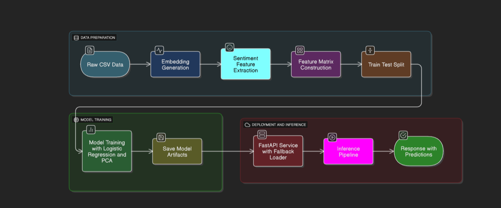

# Mundos Risk Analysis: Multiclass Interest Prediction Pipeline


## Model Names Used

**Embeddings:**
- `sentence-transformers/all-MiniLM-L6-v2` (HuggingFace)

**Sentiment:**
- `distilbert-base-uncased-finetuned-sst-2-english` (HuggingFace)

## Overview & Rationale

This project delivers a robust, production-ready pipeline for predicting customer interest stage (0=no_interest, 1=mild_interest, 2=strong_interest) from conversational lead summaries. It leverages:
- Transformer-based text embeddings (**MiniLM**, see above)
- Rich sentiment features (**DistilBERT SST-2**, see above; 7 engineered columns)
- Dimensionality reduction (PCA, 95% variance)
- Multinomial Logistic Regression (with grid search)
- Unified pipeline artifact for reproducible inference
- FastAPI backend for real-time serving

**Why this approach?**
- Embeddings capture nuanced semantic signals from both customer and agent summaries.
- Sentiment features add interpretable emotional context, improving model discrimination.
- PCA reduces dimensionality, improves generalization, and speeds up inference.
- Logistic Regression is robust, interpretable, and well-calibrated for probability outputs.
- Unified pipeline (scaler, PCA, model, metadata) ensures consistency between training and serving.

## Achievements
- Achieved macro ROC AUC (OvR): **0.9977** and macro F1: **0.9917** on held-out test data.
- Model robust to feature drift (validated via masking and diagnostics).
- End-to-end reproducibility: all steps, artifacts, and metrics are versioned.
- FastAPI backend supports real-time prediction with full probability vector and metadata.
- Modular design: easy to swap embedding models, sentiment logic, or add new features.
- Comprehensive test suite for data integrity, feature logic, and pipeline correctness.

## Folder Structure (Key Items)
```
mundos_risk_analysis/
├─ interest_multiclass/       # Main multiclass pipeline (scripts, artifacts, README)
├─ fastapi_backend/           # Production inference backend (FastAPI)
├─ artifacts/                 # Timestamped baseline models & metrics JSON
├─ tests/                     # Unit tests (data validation, pooling, PCA, etc.)
├─ flowcharts/                # Diagrams / mermaid sources
├─ ... (other legacy scripts)
```

## End-to-End Workflow (Recommended)

### 1. Data Validation
Check schema and label integrity:
```powershell
uv run python interest_multiclass/data_validation.py
```
Output: `interest_multiclass/data_integrity_report.json`


### 2. Embedding Generation
Create customer and agent embeddings using **MiniLM**:
```powershell
uv run python interest_multiclass/generate_embeddings_interest.py --data leads_1.csv
```
Output: `interest_multiclass/embeddings_interest.npz`

### 3. Sentiment Feature Generation (Recommended)
Add 7 engineered sentiment features using **DistilBERT SST-2**:
```powershell
uv run python interest_multiclass/generate_sentiment_interest.py
```
Output: `interest_multiclass/sentiment_interest.csv`

### 4. Model Training (Logistic Regression + PCA)
Train with standardization, PCA (95% variance), and grid search:
```powershell
uv run python interest_multiclass/train_logreg.py --standardize --search --pca --pca-variance 0.95
```
Artifacts:
- `interest_multiclass/artifacts/logreg_pipeline.pkl` (unified pipeline)
- `interest_multiclass/artifacts/metrics_logreg.json` (metrics)
- `interest_multiclass/artifacts/pca_transform.pkl` (PCA object)
- `interest_multiclass/artifacts/pca_variance.png` (variance plot)

### 5. Batch Inference
Generate predictions for new leads:
```powershell
uv run python interest_multiclass/inference.py --model interest_multiclass/artifacts/logreg_pipeline.pkl --input leads_1.csv --output predictions_interest.csv
```
Output: `predictions_interest.csv` (includes predicted_stage and probability columns)

### 6. Real-Time Serving (FastAPI)
Start backend for live predictions:
```powershell
uv run uvicorn fastapi_backend.main:app --host 0.0.0.0 --port 8000 --reload
```
Health check:
```powershell
curl http://localhost:8000/health
```
Predict (example):
```powershell
curl -X POST http://localhost:8000/predict -H "Content-Type: application/json" -d '{"customer_summary":"Customer asked about pricing tiers","agent_summary":"Agent explained premium plan and scheduled a follow-up"}'
```

### 7. Testing
Run all unit tests:
```powershell
uv run python -m pytest -q
```

## Detailed Notes & Tips
- **Feature order:** Embeddings and sentiment features are concatenated before scaling and PCA (matches training pipeline).
- **Artifacts:** All model, scaler, PCA, and metrics are saved for reproducibility.
**Environment variables:**
	- `MODEL_PATH`: Path to pipeline pickle (default: `fastapi_backend/best_interest_pipeline_1.pkl`)
	- `EMB_MODEL`: Embedding model name (default: `sentence-transformers/all-MiniLM-L6-v2`)
	- `SENT_MODEL`: Sentiment model name (default: `distilbert-base-uncased-finetuned-sst-2-english`)
	- `SKIP_SENTIMENT_MODEL`: Set to `1` to disable sentiment features at runtime
	- `USE_GPU`: Set to `1` to prefer CUDA
	- `INTEREST_CLASS_NAMES`: Override class label mapping
	- `FORCE_SENTIMENT_WIDTH`: Force sentiment width (2 or 7) if metadata absent
- **Metrics:**
	- Macro ROC AUC (OvR): 0.9977
	- Macro F1: 0.9917
	- Weighted F1: 0.9918
	- Log Loss: 0.059
	- Per-class precision/recall/f1, confusion matrix, PCA variance plot
- **Achievements:**
	- High accuracy and calibration on multiclass interest prediction
	- Modular, extensible, and reproducible pipeline
	- FastAPI backend for real-time scoring
	- Full test coverage for data, features, and model logic

## Why This Flow?
- **Semantic + Sentiment Fusion:** Combining transformer embeddings with engineered sentiment features captures both deep semantic and emotional signals, improving model accuracy and interpretability.
- **Dimensionality Reduction:** PCA ensures the model is efficient, less prone to overfitting, and easier to serve in production.
- **Unified Pipeline:** Saving scaler, PCA, and model together guarantees that inference matches training exactly, eliminating feature drift and deployment bugs.
- **Modular Design:** Each step is scriptable, testable, and replaceable—future upgrades (e.g., new embedding models, calibration, drift monitoring) are easy to add.

## Extending & Next Steps
- Add drift monitoring, SHAP explanations, or batch prediction endpoints.
- Integrate calibration (isotonic/sigmoid) if further probability refinement needed.
- Add model registry/version manifest for artifact governance.
- Expand test suite for API regression and integration.

---
For deeper methodology, metrics, and design rationale, see `interest_multiclass/README.md` and `PROJECT_OVERVIEW.md`.

---
## 5. Serving the Model
Run the FastAPI backend (supports GPU if `USE_GPU=1` and CUDA available):
```powershell
uv run uvicorn fastapi_backend.main:app --host 0.0.0.0 --port 8000 --reload
```
Health check:
```powershell
curl http://localhost:8000/health
```
Predict (example payload):
```powershell
curl -X POST http://localhost:8000/predict -H "Content-Type: application/json" -d '{"customer_summary":"Customer asked about pricing tiers","agent_summary":"Agent explained premium plan and scheduled a follow-up"}'
```

Environment overrides (optional):
| Variable | Default | Effect |
|----------|---------|--------|
| `MODEL_PATH` | `fastapi_backend/best_interest_pipeline_1.pkl` | Path to unified pipeline. |
| `EMB_MODEL` | `sentence-transformers/all-MiniLM-L6-v2` | Embedding model name. |
| `SENT_MODEL` | `distilbert-base-uncased-finetuned-sst-2-english` | Sentiment model (HF). |
| `SKIP_SENTIMENT_MODEL` | `0` | Set `1` to disable sentiment at runtime. |
| `USE_GPU` | `0` | Set `1` to prefer CUDA. |
| `INTEREST_CLASS_NAMES` | `0:no_interest,1:mild_interest,2:strong_interest` | Class label mapping. |
| `FORCE_SENTIMENT_WIDTH` | (blank) | Force sentiment width (2 or 7) if metadata absent. |

---
## 6. Metadata & Features
Unified pipeline pickle includes (when available):
`{ model, scaler, pca, n_components, sentiment_used, feature_dim, original_feature_dim, calibrated, algorithm }`.

Runtime feature build order in API: embeddings (customer + agent) → optional sentiment (2 or 7 cols) → scaler → PCA → logistic regression.

---
## 7. Common Issues
| Symptom | Cause | Resolution |
|---------|-------|------------|
| Feature dimension mismatch | Sentiment usage differs between train/infer | Use same sentiment setting or set `FORCE_SENTIMENT_WIDTH`. |
| First request slow | HuggingFace model download | Warm by calling `/health` or `/predict` once. |
| GPU not used | CUDA not present / `USE_GPU` unset | Export `USE_GPU=1` and ensure torch with CUDA installed. |

---
## 8. Extending
Ideas: add drift monitoring, isotonic calibration comparison, SHAP explanations on PCA space, batch /predict endpoint, embedding caching layer.

---
## 9. License
Internal / unspecified. Add a LICENSE file before distribution.

---
For deeper methodology & metrics see `PROJECT_OVERVIEW.md`.
