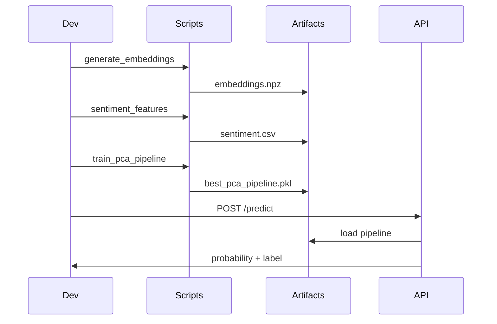

df = load_leads()
## Mundos Risk Analysis

End-to-end text → feature → calibrated PCA logistic regression pipeline for lead conversion scoring, plus a FastAPI inference backend.

### 🚀 Quick Start
```powershell
uv sync
uv run python generate_embeddings.py --output embeddings.npz
uv run python sentiment_features.py --output sentiment.csv
uv run python train_pca_pipeline.py --embeddings embeddings.npz --sentiment sentiment.csv --components 10,50,100 --standardize --calibrate sigmoid --save-best best_pca_pipeline.pkl --results pca_sweep_results.json
uv run python inference_pca_pipeline.py --pipeline best_pca_pipeline.pkl --embeddings embeddings.npz --sentiment sentiment.csv --output predictions_pca_pipeline.csv
```

### 📦 Core Artifacts
| File | Purpose |
|------|---------|
| leads.csv | Canonical dataset |
| embeddings.npz | MiniLM concatenated embeddings |
| sentiment.csv | Sentiment features (signed + probs) |
| best_pca_pipeline.pkl | Scaler + PCA + calibrated LogisticRegression |
| best_pca_50_pipeline.pkl / best_pca_100_pipeline.pkl | Higher-dim variants |
| pca_sweep_results.json | Component sweep metrics |

### 🔄 Pipeline Flow
```mermaid
flowchart LR
	A[leads.csv] --> B[MiniLM Embeddings]
	A --> C[Sentiment SST-2]
	B --> D[Scaler]
	D --> E[PCA (10/50/100)]
	C --> F[Concat]
	E --> F
	F --> G[Calibrated LogisticRegression]
	G --> H[Threshold Analysis]
	G --> I[FastAPI Service]
```

### 🧠 Design Highlights
* Mean pooling (mask aware) for dense sentence embeddings.
* PCA & scaling fitted only on training split in sweep (reduces leakage).
* Sigmoid calibration improves Brier; ROC AUC already near perfect.
* Sentiment adds interpretability (marginal lift) and is optional at inference.
* Shuffle + masking tests show robustness (no trivial token leakage).

### 🛠 Script Cheat Sheet
| Script | Purpose |
|--------|---------|
| generate_embeddings.py | Produce MiniLM embeddings (npz) |
| sentiment_features.py | SST-2 sentiment (7 or 2 columns) |
| train_pca_pipeline.py | Sweep components + calibrate + save best |
| inference_pca_pipeline.py | Batch predictions with saved pipeline |
| threshold_analysis.py | Precision/recall/F1 vs threshold grid |
| model_diagnostics.py | Sanity & leakage diagnostics |
| masking_stress_test.py | Token masking robustness test |
| load_leads.py | Validate / hash dataset |

### 📈 Threshold Selection
```powershell
uv run python threshold_analysis.py --pipeline best_pca_pipeline.pkl --embeddings embeddings.npz --sentiment sentiment.csv --out thresholds.json
```
Pick threshold (e.g. maximize F1 or meet precision) then pass `?threshold=` to API.

### 🌐 FastAPI Backend
Located in `fastapi_backend/` with a simplified `main.py`:
1. Lazy loads pipeline dict `{scaler,pca,model,...}`
2. Embeds & (optionally) scores sentiment on request text
3. Applies scaler → PCA → concatenates sentiment → predict_proba
4. Supports `SKIP_SENTIMENT_MODEL=1` and custom `threshold` query param

Warm start (PowerShell):
```powershell
uv run uvicorn fastapi_backend.main:app --reload --port 8000
```

### ▶️ Development Sequence


### 📊 Pipeline Pickle Metadata
`{ scaler, pca, model, n_components, variance_sum, sentiment_used, feature_dim, calibrated }`

`feature_dim = n_components + (#sentiment cols)` (2 or 7). The backend infers how many sentiment columns to append.

### ⚠️ Common Pitfalls & Fixes
| Problem | Cause | Fix |
|---------|-------|-----|
| Feature dim mismatch | Skipped scaler/PCA at inference | Use the saved pipeline or backend |
| Slow first request | HF model download | Hit /predict once to warm cache |
| Sentiment mismatch | Regenerated only embeddings or sentiment | Regenerate both artifact sets |

### 🔮 Backlog (Not Yet Implemented)
Drift monitoring • Model card • Multi-model (10/50/100) routing • Isotonic calibration comparison • Embedding cache in API • Batch /predict endpoint.

### 🧪 Tests
```powershell
uv run python -m pytest -q
```

### License
Internal / unspecified (add if distributing).

---
Need an extra script, endpoint, or diagram? Open an issue / request it.
